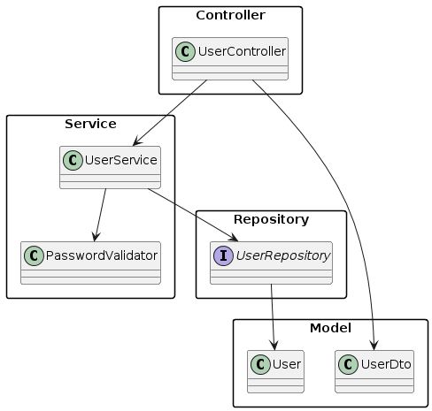

# Nisum Application

## Descripción

API RESTful creada como prueba para Nisum

## Diagrama de la API

## Requisitos

- Java 11 o superior
- Maven 3.6.3 o superior
- H2 Database (Base de datos en memoria para pruebas)
- Spring Boot 3.3.0

## Instalación

1. Clona el repositorio:
   ```bash
   git clone https://github.com/tu_usuario/nisum-app.git
   cd nisum-app
   
2. Compila y construye el proyecto con Maven
   ```bash
   mvn clean install
3. Ejecución: Para ejecutar la aplicación localmente, usa el siguiente comando de Maven:
   ```bash
   mvn spring-boot:run

4. La aplicación estará disponible en:
   ```bash
   http://localhost:8080.
4. Pruebas
   ```bash
   mvn test
5. Swagger
   ```bash
   http://localhost:8080/swagger-ui/index.html#/
6. Expresion regular para password en "application.properties"
   ```bash
   #Al menos 8 caracteres, una letra y un numero
   password.regex="^(?=.*[A-Za-z])(?=.*\\d)[A-Za-z\\d]{8,}$"